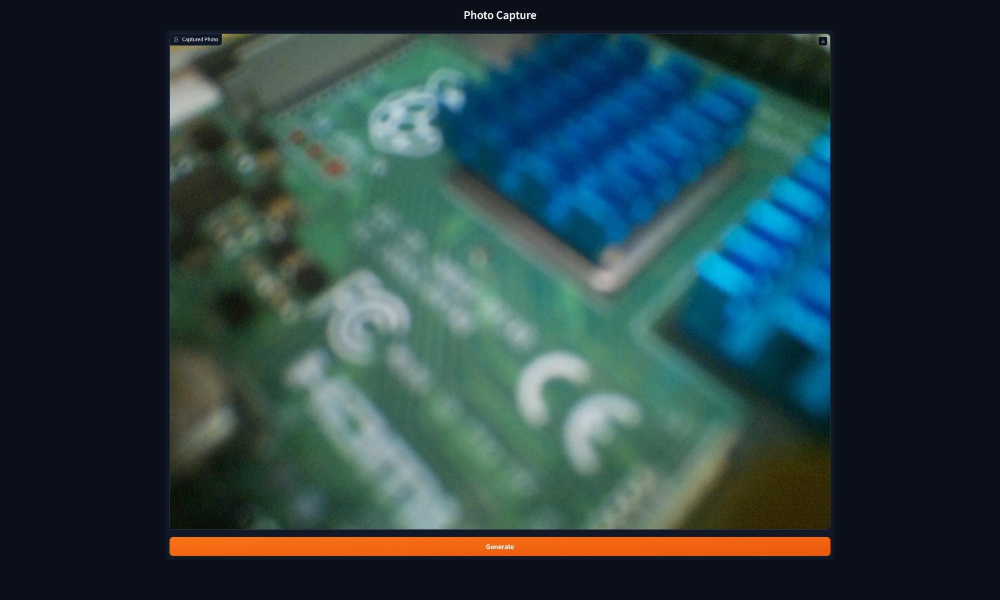
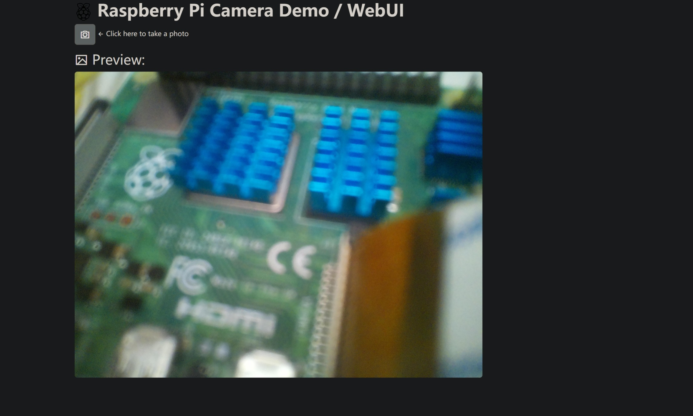

# Raspberry Pi Camera Demo / WebUI

这是一个无聊的树莓派摄像头 Demo, 允许用 WebUI 直接拍摄

代码使用 ChatGLM 生成, 并进行了一些小修改, 使用 WTFPL 进行开源

__本项目在树莓派 4B 测试通过__

_树莓派摄像头官方资料：https://www.raspberrypi.com/documentation/computers/camera_software.html_

## 警告

- 本项目使用到了 `libcamera` 无法保证在所有设备上都能正常运行, 已知支持传感器如下
  - OV5647
  - IMX219
  - IMX477
  - IMX296
  - IMX708
  - IMX290
  - IMX327
  - IMX378
  - OV9281

- 确保您的树莓派启用了相机支持, 请配置引导分区的`config.txt`, 或使用 `sudo raspi-config` 启用. Bookworm (Debian 12) 默认已启用

- 仅限测试使用, 不要将本项目未经修改直接用于部署, 以避免潜在的风险甚至数据泄露!

## 项目依赖

执行...

```bash
pip install -r requirements.txt
```
以安装项目依赖

由于使用到了 `libcamera`, 您可能需要安装它 (Raspberry Pi OS 已预装)

## 运行

### Flask 版本:

```bash
python flaskWebUI.py
```
在同局域网内的任何设备浏览器打开该设备 IP 的 __5000__ 端口页面, 即为本项目 WebUI

打开后点击照相按钮即可!

### Gradio 版本:

```bash
python gradioWebUI.py
```
在同局域网内的任何设备浏览器打开该设备 IP 的 __7860__ 端口页面, 即为本项目 WebUI, 当然可以将 `iface.launch()` 设置为 `iface.launch(share=True)` 开启公网共享 (请谨慎使用)

打开以后点击 _“Generate”_ 按钮即可

## TODO

- [ ] 视频录制支持
- [ ] 自定义 GPIO 引脚控制
- [ ] 图片另存为
- [ ] 图片压缩
- [ ] 自定义变焦

## 截图




## 其他

这里只是简单搞了一个测试, 本项目可能长期不会维护, 若要满足个人需求, 欢迎 Fork

在开启照相后会将 BCM GPIO 4 和 17 调为高电平, 完成后恢复低电平, 可自定义, 针脚定义具体以 https://pinout.xyz 为准

项目代码聊天内容已经被 ChatGLM 折腾坏了, 后面 (可能) 会自己搞一些功能

## 许可证

~~~
            DO WHAT THE FUCK YOU WANT TO PUBLIC LICENSE
                    Version 2, December 2004

 Copyright (C) 2004 Sam Hocevar <sam@hocevar.net>

 Everyone is permitted to copy and distribute verbatim or modified
 copies of this license document, and changing it is allowed as long
 as the name is changed.

            DO WHAT THE FUCK YOU WANT TO PUBLIC LICENSE
   TERMS AND CONDITIONS FOR COPYING, DISTRIBUTION AND MODIFICATION

  0. You just DO WHAT THE FUCK YOU WANT TO.

~~~

<a href="http://www.wtfpl.net/"></a>
